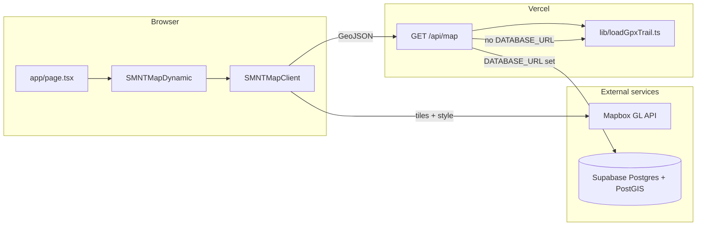
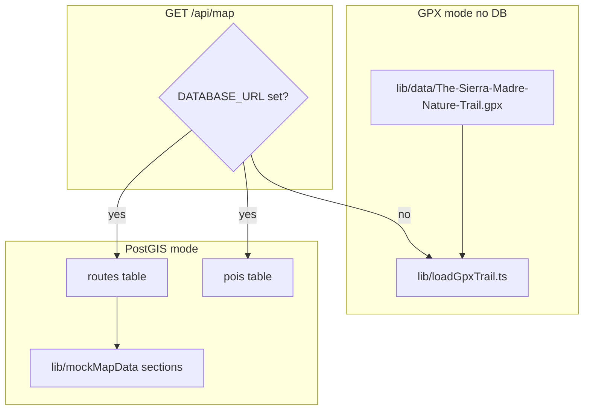
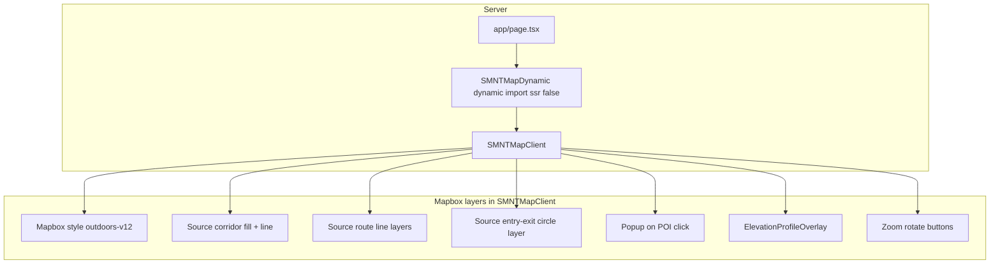
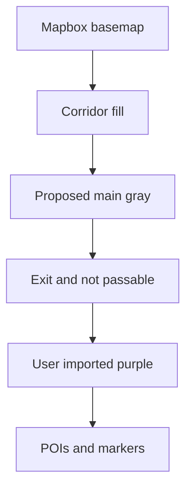

# SMNT Web Mapping Architecture

**Purpose:** Canonical reference for how the Sierra Madre Nature Trail (SMNT) interactive map is built, how geospatial data flows from storage to the browser, and how the data model should evolve so official routes and user-contributed tracks are structured correctly.

**Related docs:**

- [CONTEXT.md](./CONTEXT.md) — product vision (route colors, GPX input, verification)
- [MVP_CONTEXT.md](./MVP_CONTEXT.md) — MVP scope (PostGIS, map-first home)
- [MVP2_CONTEXT.md](./MVP2_CONTEXT.md) — locked view, sections, horizontal orientation
- [UI_UX_FLOW.md](./UI_UX_FLOW.md) — user flows and shipped map interactions
- [DESIGN_HIFI.md](./DESIGN_HIFI.md) — design tokens and screen specs
- [DEPLOY.md](./DEPLOY.md) — Vercel + Supabase deployment

---

## 1. Purpose and scope

The SMNT site is **map-first**: the home page centers on an interactive web map showing the proposed trail network, corridor, elevation profile, and points of interest. This document covers:

- System components and runtime modes
- Current Postgres/PostGIS schema and API contract
- Target data model (proposed main route as gray baseline, user-imported routes on top)
- Map layer ordering and styling
- Recommended technology stack and migration path

Out of scope here: ad placement, static pages (About, Contact), auth design details (documented as future work).

---

## 2. System context



| Component | Role |
|-----------|------|
| **Next.js (App Router)** | Pages, API routes, SSR boundaries for heavy client code |
| **Mapbox GL JS** | Basemap (`outdoors-v12`), camera (zoom, bearing), vector rendering |
| **react-map-gl** | React bindings for Mapbox (`Map`, `Source`, `Layer`, `Popup`) |
| **Turf.js** | Buffers, distances, bbox, along-route points (client + server) |
| **PostgreSQL + PostGIS** | Optional source of truth for official routes and POIs |
| **Supabase** | Hosted Postgres with PostGIS extension |
| **Vercel** | App hosting; env vars for Mapbox token and DB connection |

### Environment variables

| Variable | Required | Where used |
|----------|----------|------------|
| `NEXT_PUBLIC_MAPBOX_TOKEN` | Yes (for map display) | Client: `SMNTMapClient` |
| `DATABASE_URL` | No | Server: `app/api/map/route.ts` — enables PostGIS mode |

Without `NEXT_PUBLIC_MAPBOX_TOKEN`, the map shows a configuration message. Without `DATABASE_URL`, the API serves GPX-derived trail data (see §3).

---

## 3. Runtime modes

`GET /api/map` ([app/api/map/route.ts](../app/api/map/route.ts)) has two data paths:



### GPX mode (no `DATABASE_URL`)

Typical for local dev and current Vercel production if only the Mapbox token is configured.

- Reads [lib/data/The-Sierra-Madre-Nature-Trail.gpx](../lib/data/The-Sierra-Madre-Nature-Trail.gpx) server-side via [lib/loadGpxTrail.ts](../lib/loadGpxTrail.ts)
- Returns a single route with `route_type: "main"` (Sierra Madre Nature Trail)
- Also returns: `trailProfile` (distance vs elevation), `trailCorridor` (Turf buffer polygon), `entryExitPoisSuggested`
- Does **not** use [lib/mockMapData.ts](../lib/mockMapData.ts) for routes in this path
- `pois` and `sections` arrays are empty

### PostGIS mode (`DATABASE_URL` set)

- Queries `routes` and `pois` with `ST_AsGeoJSON(geometry)`
- `sections` still come from mock data (not yet in DB)
- Does not currently attach GPX corridor/profile unless extended in DB mode

Without `DATABASE_URL`, the API uses the GPX file path above — not [lib/mockMapData.ts](../lib/mockMapData.ts) for routes. See [DEPLOY.md](./DEPLOY.md).

---

## 4. Component architecture



| File | Responsibility |
|------|----------------|
| [app/components/SMNTMapDynamic.tsx](../app/components/SMNTMapDynamic.tsx) | Dynamic import with `ssr: false`; loading placeholder |
| [app/components/SMNTMapClient.tsx](../app/components/SMNTMapClient.tsx) | Fetches `/api/map`, Mapbox map, sources/layers, bounds lock, rotation, zoom controls |
| [app/components/ElevationProfileOverlay.tsx](../app/components/ElevationProfileOverlay.tsx) | SVG elevation chart; click to add entry/exit POI |
| [lib/loadGpxTrail.ts](../lib/loadGpxTrail.ts) | Server-only GPX parse, profile, corridor buffer, suggested entry/exit |

### Client-side persistence (today)

- **Entry/exit POIs** added via elevation chart: stored in `localStorage` key `smnt-entry-exit-pois`
- **User-imported GPX routes** when no DB: stored in `localStorage` via [lib/userRoutesStorage.ts](../lib/userRoutesStorage.ts); merged into map as purple layers
- **With DB + v2 schema:** user routes persist via `POST /api/routes/upload` → `user_route_submissions`

---

## 5. Data architecture

### 5.1 Current schema (PostGIS)

Defined in [scripts/schema-and-seed.sql](../scripts/schema-and-seed.sql). Requires `CREATE EXTENSION postgis`.

**`routes`**

| Column | Type | Notes |
|--------|------|-------|
| `id` | uuid | Primary key |
| `name` | text | Display name |
| `route_type` | text | `main` \| `exit` \| `not_passable` |
| `geometry` | geometry(LineString, 4326) | WGS 84 |
| `explorer_credits` | jsonb | e.g. `["UST MC", "MFPI"]` |
| `opened_at` | date | Optional |

**`pois`**

| Column | Type | Notes |
|--------|------|-------|
| `id` | uuid | Primary key |
| `name` | text | |
| `poi_type` | text | `jump_off`, `supply`, `guides_shed`, `hospital`, `police`, `military` |
| `description` | text | Optional |
| `geometry` | geometry(Point, 4326) | |

### 5.2 Current limitations

Legacy v1 `routes` table and early client code mixed layer concepts. **Phases B–D** address this:

1. **Proposed main** — gray baseline via `proposedMain` / `trail_routes.category = proposed_main`
2. **Exit / not passable** — separate official layer
3. **User GPX** — `user_route_submissions` + map GPX button (API or localStorage)

Remaining gaps: `trail_sections` still mock-sourced in DB mode; route hover credits not implemented; verification workflow (Phase E).

### 5.3 Target schema (recommended)

Separate **role on the map** from **provenance** (official vs user).

#### `trail_routes` — official SMNT network

| Column | Type | Notes |
|--------|------|-------|
| `id` | uuid | PK |
| `name` | text | |
| `category` | text | `proposed_main` \| `exit` \| `not_passable` \| `verified_main` |
| `geometry` | geometry(LineString, 4326) | |
| `explorer_credits` | jsonb | |
| `opened_at` | date | |
| `verification_status` | text | `proposed` \| `verified` (supports future “ocular” badge) |

#### `user_route_submissions` — contributed tracks

| Column | Type | Notes |
|--------|------|-------|
| `id` | uuid | PK |
| `name` | text | User label |
| `geometry` | geometry(LineString, 4326) | Parsed from GPX |
| `status` | text | `pending` \| `approved` \| `rejected` |
| `source_format` | text | e.g. `gpx` |
| `submitted_at` | timestamptz | |
| `user_id` | uuid | Nullable until auth |

#### `trail_corridors` — optional persisted corridor

| Column | Type | Notes |
|--------|------|-------|
| `id` | uuid | PK |
| `geometry` | geometry(Polygon, 4326) | |
| `buffer_km` | numeric | |
| `derived_from_route_id` | uuid | FK → `trail_routes` |

Today the corridor is computed in memory with Turf `buffer` in `loadGpxTrail.ts`; persisting it allows DB-only deployments without the GPX file.

#### `trail_sections` — interactive segments

| Column | Type | Notes |
|--------|------|-------|
| `id`, `slug`, `name` | text | For `/sections/[slug]` |
| `from_poi`, `to_poi` | text | Labels |
| `description` | text | |
| `geometry` | geometry(LineString, 4326) | Segment along main route |

Currently derived in [lib/mockMapData.ts](../lib/mockMapData.ts); should move to PostGIS for DB mode.

#### `pois` — unchanged

Keep existing point table and `poi_type` enum.

#### `entry_exit_pois` — optional

Suggested entry/exit points (today computed in GPX loader from elevation threshold and spacing).

### 5.4 Target API contract

Prefer a structured response so the client can bind one Mapbox source per layer group:

```ts
type MapApiResponse = {
  proposedMain: GeoJSON.Feature<GeoJSON.LineString> | null;
  officialRoutes: GeoJSON.FeatureCollection<GeoJSON.LineString>;
  userRoutes: GeoJSON.FeatureCollection<GeoJSON.LineString>;
  corridor: GeoJSON.Feature<GeoJSON.Polygon> | null;
  pois: GeoJSON.FeatureCollection<GeoJSON.Point>;
  sections: SectionRow[];
  trailProfile: { distances: number[]; elevations: number[] } | null;
  entryExitPoisSuggested?: PoiRow[];
};
```

**Backward-compatible alternative:** Keep flat `routes[]` but add properties:

- `source`: `official` | `user`
- `category`: `proposed_main` | `exit` | `not_passable` | `verified_main`
- `status`: for user routes (`pending` | `approved`)

---

## 6. Map layer architecture

### 6.1 Target z-order and colors

Aligns with product legend ([app/page.tsx](../app/page.tsx)) and the goal: **gray proposed main underneath, user-imported routes on top**.

| Z-order (bottom → top) | Layer | Color | Data source |
|------------------------|-------|-------|-------------|
| 1 | Mapbox Outdoors basemap | — | Mapbox |
| 2 | Trail corridor (fill + outline) | `#78716c` fill ~14% opacity; `#57534e` line | Derived or `trail_corridors` |
| 3 | **Proposed main route** | **`#6B7280`** (gray-500) | `trail_routes.category = proposed_main` |
| 4 | Exit routes | `#EA580C` (orange) | `category = exit` |
| 5 | Not passable | `#991B1B` (red) | `category = not_passable` |
| 6 | **User-imported routes** | **`#A78BFA`** (purple) | `user_route_submissions` |
| 7 | POIs + entry/exit markers | Per `poi_type` / orange for entry-exit | `pois` + localStorage |



### 6.2 Implementation guidelines

- **Separate Mapbox `Source` + `Layer` per group** — implemented in [MapTrailLayers.tsx](../app/components/MapTrailLayers.tsx).
- User route layers are added **after** official layers so they draw on top.
- Corridor remains below all line work.
- `fitBounds` resets bearing to 0 in Mapbox; apply `setBearing` after fit in `onLoad`, and do not pass `bounds` in `initialViewState` (see map component comments).

### 6.3 Styling (shipped)

[MapTrailLayers.tsx](../app/components/MapTrailLayers.tsx) and the home legend ([app/page.tsx](../app/page.tsx)) use gray proposed main (`#6B7280`), orange exit, red not passable, and purple user routes per §6.1. Green **verified main** is reserved for post-ocular workflow (see [CONTEXT.md](./CONTEXT.md)).

---

## 7. Geospatial conventions

| Topic | Convention |
|-------|------------|
| **CRS** | EPSG:4326 (WGS 84) in PostGIS and GeoJSON |
| **Wire format** | GeoJSON in API responses (`ST_AsGeoJSON` on server) |
| **Mapbox coordinates** | `[longitude, latitude]` (GeoJSON order) |
| **Turf bbox** | `[minLng, minLat, maxLng, maxLat]` |
| **Mapbox fitBounds** | `[[minLng, minLat], [maxLng, maxLat]]` (SW, NE) |
| **Corridor** | Turf `buffer(line, km, { units: 'kilometers' })` — currently 8 km in GPX loader |
| **GPX ingest** | `@tmcw/togeojson` + `@xmldom/xmldom` server-side only; GPX file not exposed to client |

---

## 8. Deployment

See [DEPLOY.md](./DEPLOY.md).

| Piece | Host | Notes |
|-------|------|-------|
| Next.js app | Vercel | Set `NEXT_PUBLIC_MAPBOX_TOKEN` in project env |
| Postgres + PostGIS | Supabase | Enable PostGIS extension; run `scripts/schema-and-seed.sql` |
| Connection | Pooler URI port 6543 | Required for serverless `pg` pool |

Smoke test: home map loads with token; with `DATABASE_URL`, routes/POIs come from DB; without it, GPX trail appears.

---

## 9. Migration path

| Phase | Status | Deliverable |
|-------|--------|-------------|
| **A** | Done | [scripts/schema-v2.sql](../scripts/schema-v2.sql) — `trail_routes`, `user_route_submissions`, `trail_sections`, `trail_corridors`; migrates `routes` → `trail_routes` |
| **B** | Done | Structured `GET /api/map` (`proposedMain`, `officialRoutes`, `userRoutes`, legacy `routes[]`); [lib/mapApiService.ts](../lib/mapApiService.ts) |
| **C** | Done | [MapTrailLayers.tsx](../app/components/MapTrailLayers.tsx) — separate sources; gray proposed main, purple user routes on top |
| **D** | Done | `POST /api/routes/upload` + map **GPX** button (DB persist or localStorage fallback) |
| **E** | Planned | Auth, verification workflow, `trail_sections` seed from GPX |

---

## 10. Technology stack recommendation

### Keep (current stack is appropriate)

| Layer | Choice | Rationale |
|-------|--------|-----------|
| Frontend | **Next.js** App Router | SSR boundaries, API routes, Vercel deploy, SEO for static pages |
| Map | **Mapbox GL** + react-map-gl | Outdoors terrain, bearing lock, performance |
| Geospatial utils | **Turf.js** | Buffers, profiles, client-side interaction |
| Database | **PostgreSQL + PostGIS** | Linestrings, points, future spatial queries |
| Hosting | **Vercel + Supabase** | Matches existing deploy docs |

### Add later (Phase E+)

- **Supabase Auth** — tie submissions to users
- **Supabase Storage** — optional raw GPX archive (geometry still in PostGIS)
- **Route hover credits** — tooltip on official route segments
- **pg_tileserv / Martin** — only if GeoJSON-over-HTTP becomes a bottleneck (unlikely at MVP scale)

**Done (Phase D):** GPX upload API — [app/api/routes/upload/route.ts](../app/api/routes/upload/route.ts) validates geometry and stores in PostGIS when configured.

### Do not revert to Leaflet

The app migrated to Mapbox for rotation, outdoors styling, and maintainability. Leaflet is not recommended for this codebase.

---

## 11. Open decisions

| Decision | Options | Notes |
|----------|---------|-------|
| Proposed main source of truth | GPX file vs `trail_routes` row | GPX mode is convenient for deploy without DB; DB should own geometry long-term |
| User routes before auth | localStorage vs anonymous DB rows | Both implemented: localStorage without DB; `user_route_submissions` with DB |
| Verification workflow | Manual admin vs ocular field process | Per [CONTEXT.md](./CONTEXT.md) “badge after ocular” — Phase E |
| Legend colors | Gray proposed main vs green verified main | **Resolved:** gray proposed main shipped; green reserved for verified main |

---

## 12. File reference

| Path | Purpose |
|------|---------|
| `app/api/map/route.ts` | Map data API |
| `app/api/routes/upload/route.ts` | GPX upload to `user_route_submissions` |
| `app/components/SMNTMapClient.tsx` | Map UI |
| `app/components/MapTrailLayers.tsx` | Separate Mapbox sources per route group |
| `app/components/SMNTMapDynamic.tsx` | Client-only map loader |
| `app/components/ElevationProfileOverlay.tsx` | Elevation chart overlay |
| `lib/loadGpxTrail.ts` | GPX parse, profile, corridor |
| `lib/mockMapData.ts` | Mock sections (and legacy mock routes) |
| `lib/data/The-Sierra-Madre-Nature-Trail.gpx` | Authoritative GPX for no-DB mode |
| `scripts/schema-and-seed.sql` | PostGIS schema v1 |
